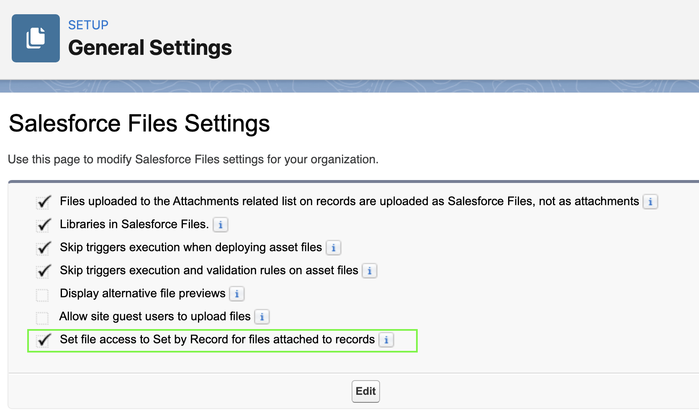
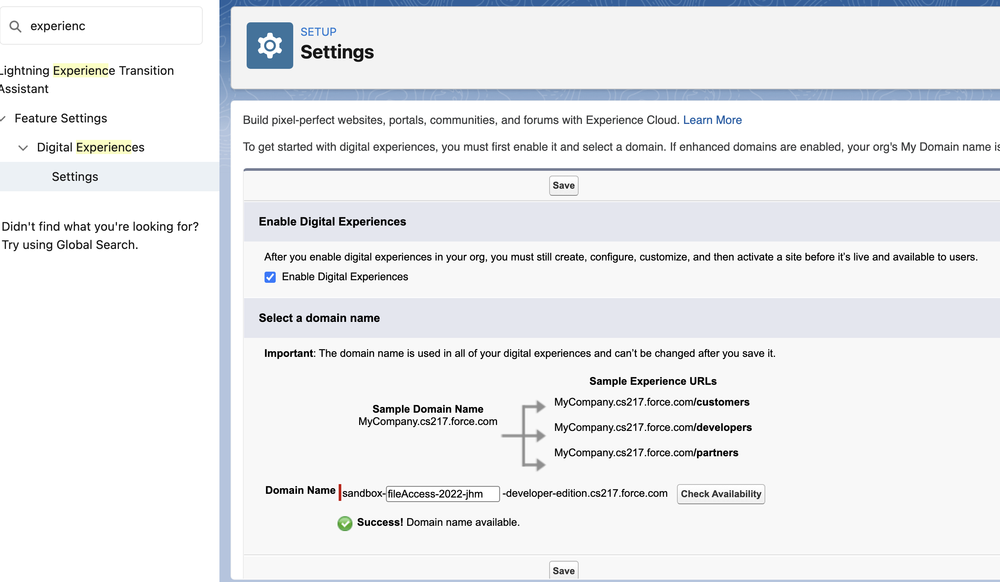
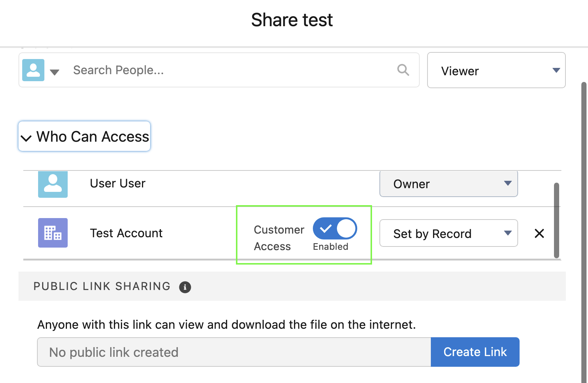
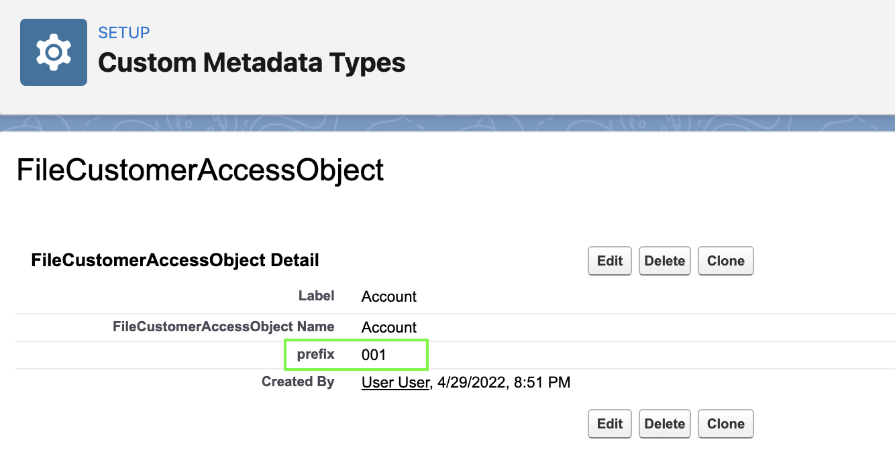

# Enable Customer Access to a File Inherited through a Record Permission

Scenario: A client has an experience site where they engage with community users. Both the internal staff and the community users maintain records on standard and custom objects and exchange notes and files uploaded to those records. The client wishes that the file's View permission is enabled by default when a staff upload a file to a record which the community users also have either View or Edit access.

## Steps to Test

1. Clone this repository
    ```shell
    $ git clone https://github.com/eehjunggnujhee/EnableCustomerAccessToFiles.git
    ```

2. Spin up a scratch org by running CumulusCI commnads
    ```shell
    $ cci org scratch dev fileAccess --days 30 # 30days scratch org lifetime
    $ cci flow run dev_org --org fileAccess
    ```
3. Enable File Access to Set By Record


4. Enabled Experience Site


5. Upload a file to an account record and validate that the file is viewable by community users


6. Add additional FileCustomerAccessObject records for other objects that you want to set up the same view permission to the related files.


** This is a personal project **